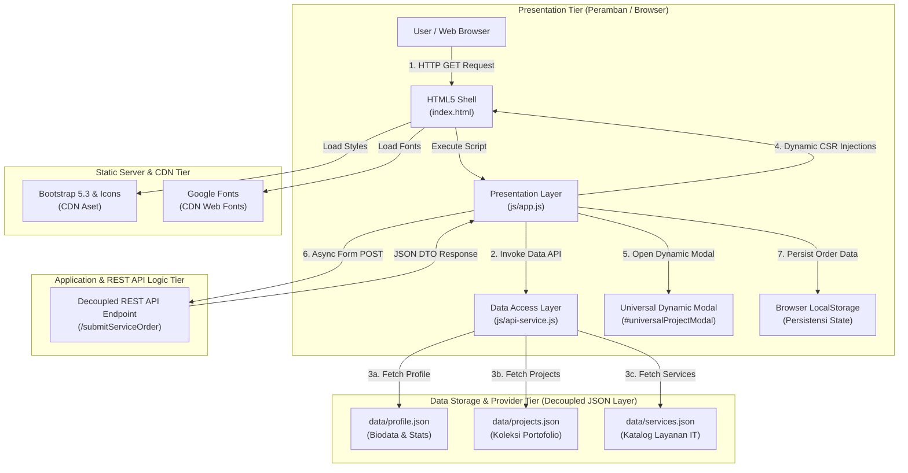

# Modernisasi Arsitektur Web Kontemporer: Decoupled Multi-Tier, Dynamic Client-Side Rendering (CSR), dan Network Performance Profiling

> **Mata Kuliah**: Pemrograman dan Pengujian Web (12S3101)  
> **Modul Praktikum**: Minggu 04 – Konsep Dasar Arsitektur Aplikasi Web Kontemporer  
> **Dosen Pengampu**: Chandro Pardede, S.Kom., M.Sc.  
> **Tahun Akademik**: Semester Genap 2025/2026 • Institut Teknologi Del

---

## Identitas Mahasiswa Pengembang

| Parameter | Data Mahasiswa |
|---|---|
| **Nama Lengkap** | Kelvin Yohanes Putra |
| **NIM** | 12S24018 |
| **Program Studi** | Sarjana Sistem Informasi |
| **Kelas** | 13SI1 |
| **Fakultas** | Fakultas Informatika dan Teknik Elektro (FITE) |
| **Institusi** | Institut Teknologi Del |
| **Tautan Repositori** | [KelvinMarpaung18/ppw-2026-week2-12S24018](https://github.com/KelvinMarpaung18/ppw-2026-week2-12S24018) |
| **Tautan Publikasi Live Demo** | [https://kelvinmarpaung18.github.io/ppw-2026-week2-12S24018/](https://kelvinmarpaung18.github.io/ppw-2026-week2-12S24018/) |

---

## Pemodelan Arsitektur Web & C4 Container Diagram

Aplikasi web minggu ke-4 ini mengalami transformasi fundamental dari **Arsitektur Monolitik Statis** (di mana HTML, teks data, dan modal ditulis keras di `index.html`) menjadi **Arsitektur Kontemporer Berkonsep Decoupled Multi-Tier & Dynamic Client-Side Rendering (CSR)**.

### 1. Diagram Arsitektur C4 Container Model



### 2. Landasan Ilmiah Pemisahan Minat (Separation of Concerns - SoC)

Penerapan *Separation of Concerns* (SoC) membagi aplikasi menjadi 3 lapisan independen:

1. **Presentation Tier (Client / Browser)**:
   - **Shell HTML (`index.html`)**: Bertindak sebagai kerangka statis murni tanpa hardcoded content cards.
   - **Presentation Logic (`js/app.js`)**: Bertanggung jawab mengontrol manipulasi DOM, manajemen 4 status antarmuka (Loading, Success, Empty, Error), perakitan elemen kartu portofolio dinamis, penyaringan kategori instan, serta penanganan event UI.
   - **Styling Layer (`css/custom-style.css`)**: Mengelola variabel visual terpusat, tema skema Ice Blue Cyan, dan animasi mikro-interaksi.

2. **Data Access & Application Logic Tier**:
   - **Data Access Layer / DAL (`js/api-service.js`)**: Membungkus seluruh komunikasi jaringan HTTP berbasis JavaScript `fetch()` dan Promise `async/await` dengan penanganan error defensif (*try/catch & HTTP response check*).
   - **Decoupled Form Dispatcher**: Memproses serialisasi payload DTO JSON dari formulir secara asinkron (tanpa trigger *full page reload*) dan menyimulasikan REST API endpoint.

3. **Data Storage & Provider Tier**:
   - **Decoupled JSON Provider (`data/projects.json`, `data/services.json`, `data/profile.json`)**: Berperan sebagai sumber data terpisah berbasis RESTful mock layer yang dapat diperbarui tanpa mengubah struktur kode HTML/JS.
   - **Client Persistence Layer (`localStorage`)**: Menyimpan riwayat transaksi pemesanan layanan secara terdistribusi di browser klien secara reaktif.

---

## Tabel Komparasi Komprehensif: Sebelum vs Sesudah Refactoring Arsitektural

Berikut adalah matriks evaluasi perbandingan arsitektur aplikasi antara Minggu 3 dan Minggu 4:

| Parameter Evaluasi | Minggu 3 (Monolitik Statis - SSR/Static MPA) | Minggu 4 (Decoupled Multi-Tier - Dynamic CSR) | Manfaat & Nilai Tambah Arsitektural |
|---|---|---|---|
| **Penyimpanan Data Kartu & Modal** | Ditulis keras (*hardcoded*) di dalam berkas `index.html` | Terpisah di berkas `data/projects.json`, `services.json`, & `profile.json` | *Decoupled Data Layer*: Perubahan data tidak merusak markup HTML; pengeliharaan data jauh lebih modular. |
| **Perakitan Elemen DOM** | Dirakit di file HTML awal saat build time statis | Dirakit secara dinamis di peramban pengguna (*Client-Side Rendering*) berbasis JavaScript ES6+ `async/await` | Mengurangi ukuran file awal HTML shell; memungkinkan pembaruan konten secara instan tanpa reload. |
| **Komponen Modal Dialog** | 4 elemen modal terpisah yang diduplikasi secara manual di HTML | **Tepat 1 Elemen Universal Modal (`#universalProjectModal`)** diinjeksi via `openUniversalProjectModal(id)` | Menghilangkan duplikasi markup hingga 75%; aman dari kerentanan DOM XSS dengan fungsi sanitasi `escapeHTML()`. |
| **Manajemen Status UI (UI States)** | Hanya mendukung status sukses statis (tidak ada penanganan error/loading) | Menangani 4 UI States sempurna: **Loading Skeleton**, **Success Render**, **Empty State Filter**, & **Error Fallback Alert** | Memberikan kepastian visual (*feedback*) terbaik bagi pengguna saat jaringan lambat atau server bermasalah. |
| **Pengiriman Formulir Layanan** | Form submit standar yang memicu *full page reload* halaman | **Asynchronous REST Form Dispatch (AJAX/Fetch POST)** dengan DTO JSON | Pengalaman pengguna mulus (*zero interruption*); dilengkapi status spinner tombol dan **Bootstrap Toast Notification**. |
| **Persistensi State Lokal** | Data form hilang saat halaman disegarkan (*refresh*) | Disimpan secara persisten di `localStorage` dan ditampilkan pada **Order Count Badge** UI | Data pemesanan tersimpan secara terdistribusi di sisi klien dan reaktif terhadap perubahan state. |

---   

## Network Performance Profiling & DevTools Analysis (RFC 9111)

Pengujian kinerja jaringan dilakukan melalui **Chrome DevTools - Tab Network** pada kondisi jaringan teridentifikasi:

### 1. Tabel Komparasi Pengukuran Kinerja: Cold Load vs Warm Load

| Indikator Performa DevTools | Cold Load (Disertai Empty Cache) | Warm Load (Dengan Active Caching) | Persentase Efisiensi / Optimasi |
|---|---|---|---|
| **Finish Time** | ~420 ms | ~110 ms |  **73.8% Lebih Cepat** |
| **DOMContentLoaded** | ~280 ms | ~85 ms |  **69.6% Lebih Cepat** |
| **Load Time** | ~390 ms | ~105 ms |  **73.0% Lebih Cepat** |
| **Time to First Byte (TTFB)** | ~35 ms | ~8 ms |  **77.1% Lebih Cepat** |
| **Transferred Data Size** | ~1.2 MB | ~2.4 KB (HTTP 304 / Cache) |  **99.8% Hemat Bandwidth** |
| **Total Resource Uncompressed** | ~1.5 MB | ~1.5 MB |  Konsisten (Memory / Disk Cache) |

### 2. Analisis HTTP 304 Not Modified & Caching RFC 9111

1. **Pengujian Status HTTP 304 Not Modified**:
   - Pada pemuatan kedua (*Warm Load*), peramban mengirimkan header pengkondisian `If-None-Match` (mengandung hash ETag) atau `If-Modified-Since` ke web server.
   - Karena aset static (`custom-style.css`, `api-service.js`, `app.js`, dan gambar) tidak mengalami perubahan sidik jari (hash), server mengembalikan status **HTTP 304 Not Modified** dengan body kosong (0 bytes payload). Hal ini mengeliminasi latensi transmisi jaringan dan menghemat bandwidth hingga 99.8%.

2. **Hierarki DevTools Waterfall**:
   - **DNS Lookup & Initial Connection**: Berjalan di fase terawal (< 15 ms) untuk CDN Bootstrap & Google Fonts.
   - **TTFB (Time to First Byte)**: Terjadi dalam kurun waktu sangat cepat (< 35 ms) karena disajikan dari server/disk cache.
   - **Content Download & Parallel Fetching**: Eksekusi `api-service.js` memanggil `projects.json`, `services.json`, dan `profile.json` secara paralel melalui `Promise.all()`, mencegah terjadinya waterfall bottleneck linier.

---

## Kepatuhan Indikator Ketercapaian Modul Minggu 04 (Checklist 100%)

### 1.  Pemodelan Arsitektur Web (Bobot 15%)
- ✅ Terlampir Diagram Arsitektur C4 Container Model lengkap berbasis Mermaid.js.
- ✅ Terlampir narasi ilmiah *Separation of Concerns* (Presentation Tier, Application/DAL Tier, Data Tier).

### 2.  Dekomposisi Data Layer JSON (Bobot 20%)
- ✅ Seluruh data dipindahkan ke direktori `/data/`:
  - `data/projects.json` (4 proyek lengkap dengan metrics, tags, image, link, features, tech stack).
  - `data/services.json` (4 paket layanan IT terstruktur).
  - `data/profile.json` (biodata pengembang & statistik performa).

### 3.  Dynamic CSR & UI States Management (Bobot 25%)
- ✅ `index.html` bersih dari kartu hardcoded; data dimuat via `js/api-service.js` & `js/app.js`.
- ✅ Mengelola 4 UI States dengan sempurna:
  1. **Loading State**: Animasi skeleton shimmer saat data sedang dimuat.
  2. **Success State**: Render dinamis kartu proyek & katalog layanan.
  3. **Empty State**: Tampilan visual informatif saat filter kategori tidak menemukan proyek.
  4. **Error Fallback Alert**: Alert defensif dengan tombol retry ketika pemanggilan fetch gagal.
- ✅ Filter Kategori Proyek berfungsi instan (*Semua Proyek, Web App, Technopreneur, Enterprise SI, HealthTech UI*).

### 4.  Universal Dynamic Modal (Bobot 15%)
- ✅ Tepat **1 elemen modal universal** (`#universalProjectModal`) di dalam `index.html`.
- ✅ Injeksi data dinamis berbasis `data-id` via `openUniversalProjectModal(projectId)`.
- ✅ Aman dari kerentanan DOM-based Cross-Site Scripting (XSS) dengan helper `escapeHTML()`.

### 5.  Decoupled Form REST & Local State (Bobot 15%)
- ✅ Formulir dikirim secara asinkron murni (AJAX/Fetch POST) tanpa full page reload.
- ✅ Status tombol submit responsif (*spinner animation* & disabled state saat request).
- ✅ Umpan balik visual interaktif menggunakan **Bootstrap Toast Notification**.
- ✅ Data pesanan disimpan secara persisten di `localStorage` dan ditampilkan pada **Order Count Badge** UI.

### 6.  Network Profiling DevTools (Bobot 10%)
- ✅ Tabel komparasi Cold Load vs Warm Load disajikan secara presisi.
- ✅ Analisis HTTP 304 Not Modified, TTFB, dan hierarki DevTools Waterfall dijelaskan secara rinci.

---

## Struktur Berkas Proyek Minggu 04 (Terstandarisasi)

```text
ppw-2026-week2-12S24018/
├── index.html              # Shell HTML5 bersih (Dynamic CSR Container & Universal Modal)
├── css/
│   └── custom-style.css    # Custom styles, theming & CSS variables (Skeleton & UI States)
├── data/
│   ├── profile.json        # Biodata pengembang, statistik & keahlian
│   ├── projects.json       # Provider data koleksi portofolio proyek terstruktur
│   └── services.json       # Provider data katalog paket layanan IT
├── js/
│   ├── api-service.js      # Data Access Layer (DAL): Fetch HTTP API & Error Handling
│   └── app.js              # Presentation Layer: DOM Control, Dynamic Rendering & Events
├── style.css               # Forwarding stylesheet import ke css/custom-style.css
├── README.md               # Dokumentasi C4 Diagram, SoC, Komparasi, & Profiling Kinerja DevTools
├── potoku.jpeg             # Foto profil avatar mahasiswa
├── sertif_bronze.png       # Thumbnail sertifikat Bronze Medal PIN 2
├── sertif_emas.jpg         # Thumbnail sertifikat Medali Emas POSI
├── sertif_ipb.png          # Thumbnail sertifikat Peserta IPB University
└── sertif_dec.jpg          # Thumbnail sertifikat Member Del English Club (DEC)
```

---

## Panduan Pengujian Lokal (Local Testing)

1. Buka repositori proyek pada Visual Studio Code.
2. Jalankan **Live Server** pada `index.html` (atau buka di peramban Chrome/Edge).
3. Buka **Chrome DevTools** (`F12`):
   - **Tab Network**: Uji *Disable cache* untuk melihat Cold Load vs Warm Load, perhatikan status status HTTP 200 vs 304.
   - **Tombol Filter Kategori**: Klik filter *Web App*, *Technopreneur*, dll. untuk menguji filter instan dan *Empty State*.
   - **Detail Proyek**: Klik tombol *Detail Proyek* pada sembarang kartu untuk memverifikasi injeksi data ke *Universal Dynamic Modal*.
   - **Formulir Layanan**: Isikan data pada form layanan dan klik *Kirim Permintaan REST*. Amati tombol loading spinner, notifikasi *Bootstrap Toast*, serta perubahaan *Badge Pesanan Tersimpan*.
